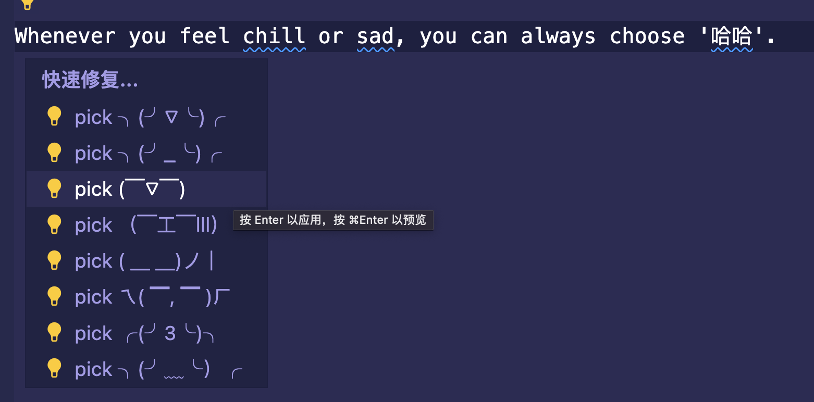

# vscode-emoticon-sample-plugin
This sample forks from vscode-extension-samples/[code-actions-sample](https://github.com/microsoft/vscode-extension-samples/tree/main/code-actions-sample).

Emoticon-sample support used in markdown file. When check some key words(match any tags in ./yan.json file), then warnings maybe triggered and CodeAction.QuickFix can help user to resolve the problem.

demo:

User can input words like: **chill**、**sad**、**哈哈** etc. then warnings can help user select any emoticon to replace current word.

## VS Code API

### `vscode` module

- [`languages.registerCodeActionsProvider`](https://code.visualstudio.com/api/references/vscode-api#languages.registerCodeActionsProvider)
- [`Diagnostic.code`](https://code.visualstudio.com/api/references/vscode-api#Diagnostic)
- [`CodeActionContext.diagnostics`](https://code.visualstudio.com/api/references/vscode-api#CodeActionContext)

